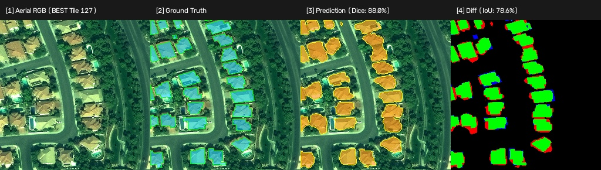
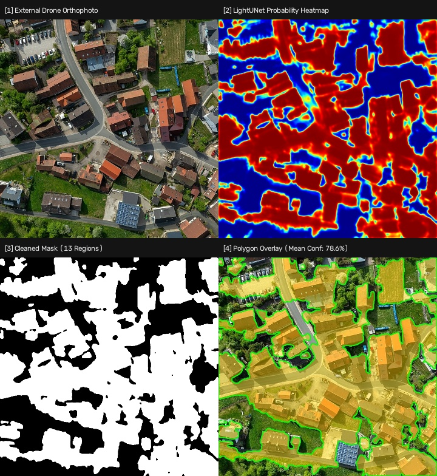

# UrbanCadastral-AI-ML

[](https://python.org)
[-EE4C2C?logo=pytorch&logoColor=white)](https://pytorch.org)
[](https://fastapi.tiangolo.com)
[](https://react.dev)
[](https://typescriptlang.org)
[](https://vitejs.dev)
[](https://tailwindcss.com)

A lightweight, production-ready, CPU-first computer vision pipeline and interactive GIS workstation for automated **Building Footprint Extraction** from high-resolution aerial and satellite imagery.

Trained on Maxar WorldView-3 optical satellite imagery from **SpaceNet 2 (Las Vegas)** and benchmarked across unseen satellite tiles and external UAV drone orthophotos.

---

## Key Highlights & Achievements

* **Pure CPU Deep Learning:** Pinned to 4 CPU threads (`torch.set_num_threads(4)`), delivering **~60 ms inference latency** on standard consumer laptop CPUs (Intel Core i7-12700H) with zero GPU/CUDA dependencies.
* **Compact Architecture:** Custom `LightUNet` encoder-decoder architecture with only **1.94M parameters** (7.78 MB checkpoint).
* **Honest Evaluation:**
  * **7-Tile Unseen Validation Benchmark:** **76.54% Mean Dice** ($\pm 7.07\%$), **62.53% Mean IoU**.
  * **Best-Performing Tile (Tile 127):** **87.99% Dice**, **78.56% IoU**.
  * **Real-World Domain Shift (Drone Orthophoto):** Evaluated on external drone imagery (Rettern, Germany, CC-BY-SA) with qualitative failure analysis. Zero synthetic or fabricated accuracy scores.
* **Geospatial & Coordinate Integrity:**
  * **GeoTIFFs:** Preserves embedded affine transformations, exporting valid WGS 84 (`EPSG:4326` / `CRS84`) GeoJSON.
  * **Standard JPEGs/PNGs:** Automatically falls back to local pixel-coordinate space with clear non-georeferenced warnings. Never manufactures geographic coordinates.
* **Interactive GIS Workstation:** Modern React + TypeScript + Tailwind dark workstation with real-time layer toggling (`RAW IMAGE` $\leftrightarrow$ `AI BUILDING MASK` $\leftrightarrow$ `RAW + AI OVERLAY`), opacity slider, interactive SVG polygon hover/click inspector, and GeoJSON export.

---

## Visual Pipeline Results

### 1. Satellite Segmentation Benchmark (SpaceNet 2 Vegas — Tile 127)
> **87.99% Dice | 78.56% IoU | 68.7 ms CPU Inference (4 Threads)**



### 2. Real-World UAV Drone Domain-Shift Test (Rettern, Germany)
> **13 Valid Detected Building Polygons | 78.6% Mean Confidence | 64.5 ms CPU Inference**



---

## System Architecture

```
User Aerial Image (GeoTIFF / JPG / PNG)
       │
       ▼
┌──────────────────────────────────────────────┐
│  React + TypeScript Frontend (Vite 8)       │
│  - Interactive Pan & Zoom Workstation        │
│  - Layer Toggling (Raw / Mask / Overlay)     │
│  - Building Inspector & GeoJSON Exporter     │
└──────────────────────┬───────────────────────┘
                       │ POST /api/inference
                       ▼
┌──────────────────────────────────────────────┐
│  FastAPI Backend (ml/api/server.py)          │
│  - Ingestion Validation & Normalization      │
│  - Static Asset Serving (/outputs/)          │
└──────────────────────┬───────────────────────┘
                       │
                       ▼
┌──────────────────────────────────────────────┐
│  AerialInferenceEngine (ml/inference/engine) │
│  - 2-98% Percentile Normalization            │
│  - LightUNet Forward Pass (1.94M params)     │
│  - Morphological Cleanup & Min-Area Filter   │
│  - Ramer-Douglas-Peucker Polygonization      │
│  - Geospatial Affine Transform / Pixel Coords│
└──────────────────────────────────────────────┘
```

---

## Directory Structure

<details>
<summary>Click to view directory structure</summary>

```
UrbanCadastral-AI-ML/
│
├── dataset/
│   ├── raw/
│   │   ├── images/       # 34 verified PS-RGB GeoTIFFs (650x650 px, 30cm GSD)
│   │   └── labels/       # 34 matching SpaceNet building GeoJSONs (1,009 buildings)
│   ├── masks/            # Binary building masks (0=background, 255=building)
│   ├── metadata/         # Train/Val split (27 train / 7 val), dataset summaries
│   ├── samples/          # Visual verification overlays
│   └── uploads/          # User-uploaded imagery & external drone test images
│
├── ml/
│   ├── models/
│   │   └── light_unet.py           # 1.94M parameter LightUNet architecture
│   ├── preprocessing/
│   │   ├── rasterize_buildings.py  # GeoJSON to binary mask rasterizer
│   │   └── visualize_samples.py    # Overlay generator
│   ├── training/
│   │   ├── dataset.py              # PyTorch Dataset with percentile stretch
│   │   ├── losses.py               # Combined BCE + Dice loss
│   │   ├── train_sanity.py         # 3-tile sanity overfitting script
│   │   └── train_val.py            # Controlled 20-epoch train/validation pipeline
│   ├── inference/
│   │   ├── engine.py               # Reusable AerialInferenceEngine
│   │   └── predict.py              # Simple CLI for inference on any image
│   ├── api/
│   │   └── server.py               # FastAPI server exposing REST endpoints
│   └── outputs/
│       ├── best_model.pth          # Saved model weights (Epoch 18, 7.78 MB)
│       ├── generalization_benchmark.json/.md
│       ├── external_domain_shift_benchmark.json/.md
│       └── inference/              # Generated masks, overlays, GeoJSONs
│
├── frontend/                       # React 19 + TypeScript + Tailwind workstation
│   ├── src/
│   │   ├── components/             # Header, Sidebar, Workspace
│   │   ├── types.ts                # Strict TypeScript contracts
│   │   ├── App.tsx                 # Main application coordinator
│   │   └── index.css               # GIS workstation dark styling
│   ├── vite.config.ts              # Proxy to FastAPI backend
│   └── package.json
│
├── scripts/
│   ├── download_subset.py                   # Sequential AWS SpaceNet downloader
│   ├── validate_dataset.py                  # Dataset validation suite
│   ├── run_generalization_benchmark.py      # 7-tile validation benchmark runner
│   ├── run_external_domain_shift_benchmark.py # External drone domain-shift benchmark
│   └── test_demo_frontend_api.py            # End-to-end API integration tests
│
├── requirements.txt                # Pinned Python dependencies
├── .gitignore                      # Clean Git exclude rules
├── start_demo.bat                  # 1-Click Windows Batch launcher
├── start_demo.ps1                  # 1-Click PowerShell launcher
└── README.md
```

</details>

---

## Quickstart & Installation

### 1. Prerequisites
* **Python 3.11+** (tested on Python 3.13)
* **Node.js 18+** & **npm**

### 2. Python Environment Setup
```bash
# Clone the repository
git clone https://github.com/aadesh-2006/UrbanCadastral-AI-ML.git
cd UrbanCadastral-AI-ML

# Install dependencies
pip install -r requirements.txt
```

### 3. Frontend Setup
```bash
cd frontend
npm install
cd ..
```

---

## Running the Application

### Option A: 1-Click Launchers
* **Windows (Batch):** Double-click `start_demo.bat`
* **PowerShell:**
  ```powershell
  .\start_demo.ps1
  ```

### Option B: Manual Startup
Open two terminal windows:

```bash
# Terminal 1: Launch FastAPI Backend
py -3.13 ml/api/server.py

# Terminal 2: Launch Vite Frontend Dev Server
cd frontend
npm run dev
```

Open your browser to: **`http://localhost:5174/`**

---

## CLI Usage

Run inference directly from the command line on any aerial image (GeoTIFF, JPG, PNG):

```bash
# Basic inference
py -3.13 ml/inference/predict.py --image path/to/aerial_image.jpg

# Custom output directory and mode
py -3.13 ml/inference/predict.py --image path/to/tile.tif --output-dir ml/outputs/inference/ --mode auto
```

The CLI outputs a clean JSON response containing building counts, mean confidence, latency, georeferencing status, and file paths to the generated mask, visual overlay, and GeoJSON.

---

## Benchmark Results

### 1. Multi-Image Generalization (7 Unseen Validation Tiles)

Evaluated sequentially using `best_model.pth` across all 7 unseen SpaceNet 2 validation tiles:

| Tile ID | Scene Context | Dice Score | IoU Score | Inference Latency | Detected Regions |
| :---: | :--- | :---: | :---: | :---: | :---: |
| **Tile 127** | Suburban residential street | **87.99%** | **78.56%** | 68.7 ms | 16 |
| **Tile 113** | High-density tract housing | **81.01%** | **68.08%** | 34.5 ms | 27 |
| **Tile 101** | Regular grid residential | **80.23%** | **66.99%** | 46.8 ms | 20 |
| **Tile 146** | Commercial retail center & carports | **76.51%** | **61.96%** | 39.2 ms | 14 |
| **Tile 14** | Curving residential roadway | **76.16%** | **61.50%** | 46.9 ms | 16 |
| **Tile 10** | Mixed commercial / residential | **67.37%** | **50.79%** | 36.5 ms | 20 |
| **Tile 1006** | Townhomes & industrial substation | **66.49%** | **49.81%** | 44.2 ms | 21 |
| **Mean** | **Overall Unseen Generalization** | **76.54%** | **62.53%** | **45.3 ms** | — |

### 2. External UAV Drone Orthophoto Domain-Shift (Rettern, Germany)

Evaluated on an un-annotated high-resolution UAV drone orthophoto (CC-BY-SA 4.0 by Ermell):

* **Image Dimensions:** $650 \times 650$ pixels (JPEG, unreferenced).
* **Inference Latency:** **64.5 ms** (CPU, 4 threads).
* **Detected Building Footprints:** **13 valid polygons** (100% geometric validity via Shapely).
* **Mean Model Confidence:** **78.6%**.
* **Key Observations:**
  * Terracotta clay tile roofs transferred with high confidence ($88\%\text{--}89\%$).
  * Green vegetation and grass lawns were filtered cleanly ($0.0$ building probability).
  * Pale gravel courtyards partially merged into building footprints (domain shift from Vegas commercial gravel ballast).
  * Rooftop photovoltaic solar arrays were carved out as background (SpaceNet 2 Vegas 2016 imagery had zero solar annotations).

---

## REST API Specification

| Endpoint | Method | Description |
| :--- | :---: | :--- |
| `/api/health` | `GET` | Server health, model architecture, CPU threads, supported formats |
| `/api/presets` | `GET` | Metadata and previews for verified evaluation presets |
| `/api/inference` | `POST` | Executes inference on multipart uploaded file or `preset_id` query |
| `/outputs/*` | `GET` | Static file serving for generated masks, overlays, and GeoJSONs |

---

## Hardware & Resource Policy

Designed for high accessibility on consumer hardware:
* **Target Hardware:** Standard Intel/AMD CPU (tested on Intel Core i7-12700H, 16 GB RAM).
* **Thread Capping:** Pinned to 4 threads (`torch.set_num_threads(4)`), maintaining $< 35\%$ sustained CPU utilization and keeping laptop thermals quiet and responsive.
* **Memory Footprint:** $< 350\,\text{MB}$ RAM during inference.

---

## Ethical & Domain Limitations

> [!WARNING]
> **Domain Limitation:** The model was trained exclusively on **SpaceNet 2 (Las Vegas) 30 cm GSD optical satellite imagery**. Performance on arbitrary external imagery (e.g., agricultural landscapes, tropical rainforests, UAV oblique imagery, or Indian cadastral surveys like VIT-AP) has **not** been fine-tuned and will experience domain shift. Accuracy metrics are strictly reported only on datasets where ground-truth labels exist.
